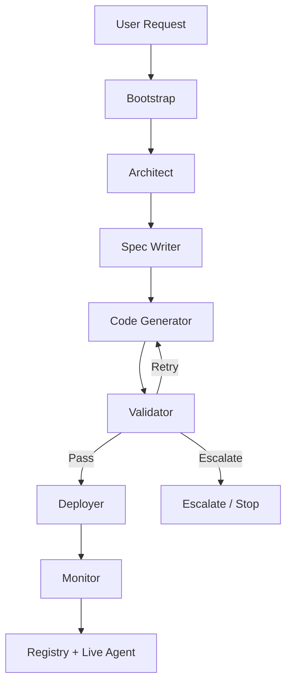
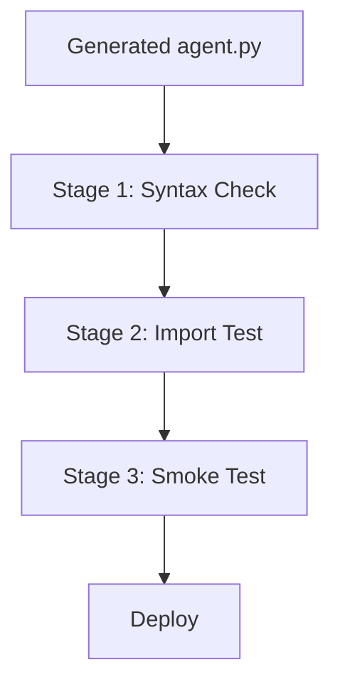
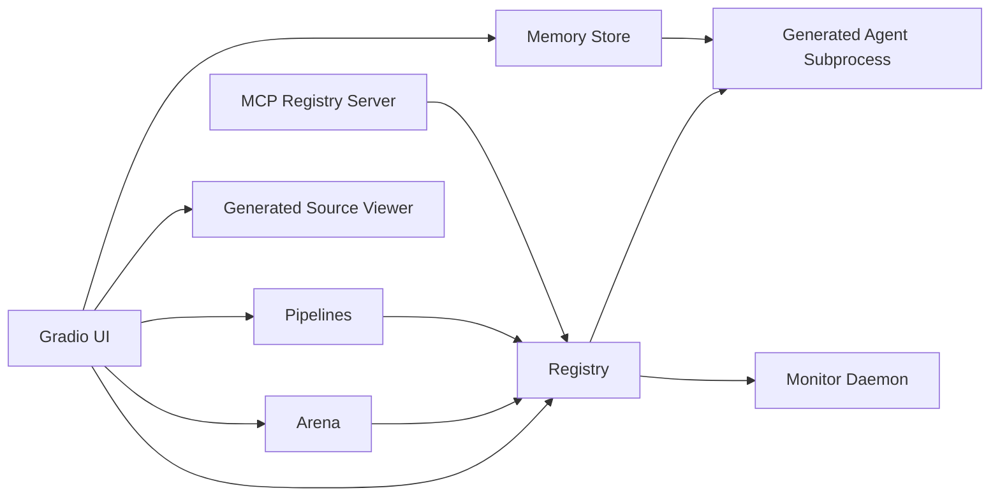

<div align="center">


<br/>

[](https://python.org)
[](https://langchain-ai.github.io/langgraph/)
[](https://ollama.ai)
[](https://gradio.app)
[](https://modelcontextprotocol.io)

<br/>

> **Not a prompt wrapper.**
> Nexus is a full agent operating system that **architects, writes, validates, deploys, monitors, benchmarks, evolves, and chains other agents at runtime**.

[Why It Stands Out](#why-nexus-stands-out) · [Architecture](#architecture) · [Quick Start](#quick-start) · [Screenshots](#screenshots) · [Project Structure](#project-structure)

</div>

---

## Overview

**Nexus Agent OS** is a standalone LangGraph-powered system where the product is not just the final answer, but the **entire lifecycle of agent creation**.

You describe the kind of agent you want.
Nexus then:

1. Decides the right graph topology.
2. Writes a strict JSON specification.
3. Generates a runnable Python agent.
4. Validates it in a sandbox with retry routing.
5. Deploys it as a live subprocess.
6. Monitors health and restarts failures.
7. Lets you inspect, benchmark, chain, and evolve it from a dedicated UI.

This repository contains **one polished product**, not a collection of unrelated demos.

---

## Why Nexus Stands Out

- **Lifecycle-native design**: architecture, code generation, validation, deployment, and monitoring are all visible, first-class steps.
- **Real generated agents**: Nexus writes actual `agent.py` files to disk, not hidden in-memory prompt chains.
- **True graph routing**: validation failures flow back into `code_gen` through a real conditional LangGraph edge.
- **Operational UI**: Mission Control, Inspector, Arena, Pipelines, Lifecycle, Analytics, and Source Code are built into the product.
- **Persistent runtime state**: registry, memory, arena results, and pipeline runs survive restarts through JSON persistence.
- **Local-first**: runs on Ollama without requiring cloud APIs.

---

## What You Can Do

Nexus is useful both as a reference architecture and as a practical local product:

- Forge task-specific agents from plain English requests.
- Inspect the generated source code before or after deployment.
- Run tasks against deployed agents with persistent memory injection.
- Compare agents head-to-head in the Arena.
- Chain agents into sequential pipelines.
- Track pipeline execution history and timings.
- Evolve agents from real task history.
- Monitor health, restart failures, and review lifecycle telemetry.

---

## Screenshots

<p align="center">
  
</p>

<p align="center">
  
  
</p>

<p align="center">
  
  
</p>

<details>
<summary><b>Open Full UI Gallery</b></summary>

<br/>


</details>

---

## Architecture

Nexus itself is a **meta-graph** that builds other agents.



### Core Lifecycle

| Stage | Responsibility | Output |
|---|---|---|
| **Bootstrap** | Initializes request state and build log | Request-scoped state |
| **Architect** | Chooses topology, tools, and complexity | Design decision |
| **Spec Writer** | Produces a strict JSON spec | `agent_spec` |
| **Code Generator** | Writes runnable `agent.py` and `smoke_test.py` | Generated code on disk |
| **Validator** | Runs syntax, import, and smoke checks | Pass / retry / escalate |
| **Deployer** | Registers and optionally spawns a subprocess | Live deployed agent |
| **Monitor** | Pings health and keeps the registry healthy | Reports + auto-restart behavior |

### The Six Meta-Agents

| Layer | Meta-Agent | What it does |
|---|---|---|
| L1 | **Architect** | Reads the user request and selects the best topology, tools, and complexity level. |
| L2 | **Spec Writer** | Converts that design into a strict JSON contract with `agent_id`, prompt, tools, and expected output. |
| L3 | **Code Generator** | Produces a complete runnable Python agent and smoke test. |
| L4 | **Validator** | Performs 3-stage validation and decides whether to deploy, retry, or escalate. |
| L5 | **Deployer** | Registers the agent, writes metadata, and spawns the worker subprocess when possible. |
| L6 | **Monitor** | Takes health snapshots and runs a background daemon that restarts unhealthy agents. |

---

## Why The Graph Matters

Most "agent builder" projects call one library helper and hide everything inside it.

Nexus is different because the control flow is explicit:

- **Validation is not a side-effect**. It is a graph node.
- **Retry is not a try/except block**. It is a real route back to `code_gen`.
- **Deployment is not abstracted away**. It is a visible stage with registry state and health checks.
- **Monitoring is not theoretical**. It is a running daemon with restart behavior.

That makes the system easier to understand, demo, debug, and extend.

---

## Validation Model

Every generated agent must pass three stages before deployment:



### Stage Breakdown

1. **Syntax check**
   Uses Python `compile()` to catch invalid code immediately.
2. **Import test**
   Loads the generated module in a subprocess to detect import-time failures.
3. **Smoke test**
   Runs `python agent.py --mode test` and requires `TEST_OK:` to appear in stdout.

If validation fails, the exact failure context is sent back into the Code Generator for another attempt.

---

## Runtime Subsystems

Once an agent is deployed, Nexus becomes an operations console for it.



### What ships in the product

- **Mission Control** for live deployed agent status.
- **Agent Inspector** for task execution, memory, search, and evolution.
- **Arena** for head-to-head benchmarking.
- **Pipelines** for multi-agent workflows with persistent run history.
- **Lifecycle** for per-agent event timelines.
- **Analytics** for system metrics, rankings, and recent activity.
- **Source Code** for generated agent inspection.
- **MCP server** for registry operations via Model Context Protocol.

---

## UI Tour

| Tab | Purpose |
|---|---|
| **Forge** | Describe an agent idea and watch the full build process stream live. |
| **Mission Control** | View deployed agents, health, task counts, topology, and runtime status. |
| **Agent Inspector** | Send tasks, inspect memory, search past interactions, and evolve agents. |
| **Arena** | Benchmark two deployed agents on the same task and score them with a judge. |
| **Pipelines** | Chain agents into workflows and inspect saved runs with timings. |
| **Lifecycle** | View event timelines from design to deployment to restart history. |
| **Analytics** | Review cross-system telemetry, topology distribution, leaderboards, and workflow activity. |
| **Source Code** | Inspect the exact generated `agent.py` file for any deployed agent. |

---

## Quick Start

### Prerequisites

- Python **3.11+**
- [uv](https://github.com/astral-sh/uv) recommended
- [Ollama](https://ollama.ai) running locally

### 1. Clone the Repository

```bash
git clone <repo-url>
cd <repo-folder>
```

### 2. Create an Environment and Install Dependencies

This repository is standalone, so install dependencies directly into a virtual environment:

```bash
uv venv
source .venv/bin/activate

uv pip install \
  gradio \
  langgraph \
  langchain-openai \
  langchain-core \
  python-dotenv \
  mcp \
  typing-extensions
```

If you prefer `pip`, the same package list works there as well.

### 3. Start Ollama

```bash
ollama serve
ollama pull qwen3:8b
```

### 4. Configure Environment

Create a `.env` file in the repository root:

```env
OLLAMA_BASE_URL=http://localhost:11434/v1
OLLAMA_BASE_MODEL=qwen3:8b
OLLAMA_MODEL=qwen3:8b

NEXUS_TEMPERATURE=0.3
NEXUS_MAX_RETRIES=3
NEXUS_MONITOR_INTERVAL=30
NEXUS_SANDBOX_TIMEOUT=150
```

### 5. Run Nexus

```bash
uv run app.py
```

Then open:

```text
http://localhost:7861
```

### 6. Optional: Run The MCP Registry Server

```bash
uv run mcp_server.py
```

---

## Example Requests To Try

Paste any of these into the Forge tab:

```text
Build me an agent that reads a CSV dataset description and produces a plain-English statistical summary with key insights.
```

```text
Create an agent that takes any Python function and explains what it does in plain English, step by step.
```

```text
Build an agent that takes a product concept and generates 10 creative marketing angle ideas, each with a one-sentence pitch.
```

```text
Make an agent that classifies a piece of text into one of these categories: News, Opinion, Tutorial, Question, or Other.
```

```text
Build an agent that takes a natural language query like "show me all orders from last month" and writes the SQL for it.
```

---

## Supported Topologies

The Architect currently chooses from five topology families:

| Topology | Best for |
|---|---|
| **chain** | Simple single-pass agents and transformations |
| **sequential** | Multi-step pipelines where each stage depends on the previous one |
| **parallel** | Specialist fan-out patterns with aggregation |
| **loop** | Iterative refinement or optimization workflows |
| **react** | Tool-using agents that need repeated reasoning and actions |

This is one of the strongest ideas in the repo: **topology is a design decision**, not an afterthought.

---

## Generated Agent Contract

Every generated agent is expected to support three modes:

| Mode | Purpose |
|---|---|
| `--mode test` | Used by validation to confirm the agent runs and emits `TEST_OK:` |
| `--mode task --input "..."` | One-shot execution for real user tasks |
| `--mode worker` | Long-lived subprocess mode for deployment and health checks |

Generated artifacts are written to:

```text
generated_agents/<agent_id>/
├── agent.py
├── smoke_test.py
└── spec.json
```

---

## Memory, Benchmarking, and Evolution

Nexus is more than a builder. It also supports operating and improving deployed agents.

### Persistent Memory

- Task runs are stored in `memory/sessions/<agent_id>.json`
- Recent memory is injected back into future tasks
- Inspector includes memory stats, search, and lightweight insights

### Arena

- Runs two deployed agents on the same task
- Uses a judge model to score **accuracy**, **clarity**, and **creativity**
- Persists results to `memory/arena_results.json`

### Pipelines

- Chains agents sequentially
- Persists named pipelines and recent run history
- Captures stage timings and success/failure metadata

### Evolution

- Reviews task history
- Critiques weaknesses
- Generates a v2
- Validates it
- Runs v1 vs v2 in the Arena
- Replaces the original only if the new version wins

---

## MCP Registry Server

Nexus includes a standalone MCP server exposing registry operations.

### Available MCP tools

- `register_agent`
- `list_agents`
- `get_agent`
- `ping_agent`
- `restart_agent`
- `kill_agent`
- `run_task`
- `get_agent_code`
- `deregister_agent`

This lets other MCP-capable systems interact with Nexus as a runtime agent registry.

---

## Project Structure

```text
.
├── app.py                         # Main Gradio application
├── graph.py                       # LangGraph meta-graph and NexusEngine
├── state.py                       # Shared typed state across meta-agents
├── registry.py                    # Registry, subprocess lifecycle, task execution
├── memory_store.py                # Persistent agent memory, search, insights
├── arena.py                       # Head-to-head benchmarking engine
├── pipeline.py                    # Pipeline builder, execution, run history
├── analytics.py                   # Cross-system analytics and telemetry rendering
├── sandbox.py                     # Syntax/import/smoke validation logic
├── mcp_server.py                  # MCP registry server
├── config.py                      # Environment configuration
├── meta_agents/
│   ├── architect_agent.py         # Topology + tool selection
│   ├── spec_writer_agent.py       # Strict JSON spec generation
│   ├── code_gen_agent.py          # Runnable Python generation
│   ├── validator_agent.py         # Validation + retry routing
│   ├── deployer_agent.py          # Registration + subprocess deployment
│   ├── monitor_agent.py           # Health snapshots + daemon restarts
│   └── evolution_agent.py         # Critique → improve → benchmark → replace
├── ui/
│   ├── css.py                     # Visual system and styling
│   ├── html.py                    # Hero and empty-state fragments
│   └── graph_viz.py               # Live graph rendering
├── images/                        # README screenshots
├── generated_agents/              # Generated runtime agents
└── memory/
    ├── registry.json              # Persistent registry
    ├── arena_results.json         # Benchmark history
    ├── pipelines.json             # Saved pipelines
    ├── pipeline_runs.json         # Workflow run history
    └── sessions/                  # Per-agent memory
```

---

## Safety Notes

Nexus includes useful safeguards, but it is still intended as a **local experimentation and advanced demo system**, not a hardened production multi-tenant runtime.

### Included safeguards

- validation before deployment
- subprocess isolation for generated agents
- sensitive env key stripping during sandbox runs
- timeouts on validation and task execution
- restart limits in the monitor daemon

### Still important

- review generated code before using it in sensitive environments
- do not treat the sandbox as container-grade isolation
- keep secrets out of the runtime unless you trust the generated code path

---

## Who This Repository Is For

This project is a good fit for:

- engineers studying advanced agent orchestration patterns
- builders who want a local-first agent factory
- AI product designers interested in visible, inspectable agent lifecycles
- technical creators who want a demo-worthy agent operating system

---

## Closing Note

Nexus is built around a simple idea:

> **If agents can build agents, the lifecycle should be visible, inspectable, and operable.**

That is what this repository demonstrates end-to-end.

---

## Other Related Works

- https://github.com/hishamcse/agentarium-multi-framework-agents
- https://github.com/hishamcse/Evolvarium-Advanced-Agentic-AI-Systems
- https://github.com/hishamcse/LinkGenius-AI

---

<div align="center">

**Built by [Syed Jarullah Hisham](https://github.com/hishamcse)**
SDE @ IQVIA · .NET & Agentic AI

<br/>

*If this helped you understand agent systems, consider starring ⭐*


</div>
